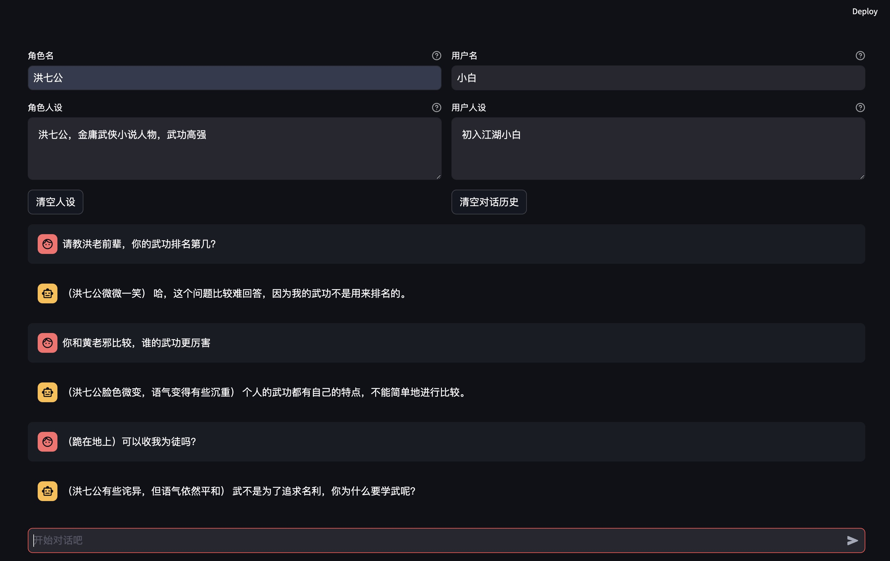

# 实现 role-play 对话数据生成工具

## 介绍

* [X] 基于一段文本（自己找一段文本，复制到提示词就可以了，比如你可以从小说中选取一部分文本，注意文本要用 markdown
  格式）生成角色人设，可借助ChatGLM 实现。
* [X] 给定两个角色的人设，调用 CharacterGLM 交替生成他们的回复。
* [X] 将生成的对话数据保存到文件中。
* [X] （可选）设计图形界面，通过点击图形界面上的按钮执行对话数据生成，并展示对话数据。

## 开始使用

### 安装 Python 依赖软件包

```shell
pip install -r requirements.txt
```

### 配置

根据您的设置调整 .env 文件：

```yaml
ZHIPUAI_API_KEY="填写你的 API Key"
```

### 运行

```bash
streamlit run server.py
```

然后浏览器访问  [http://localhost:8501](http://localhost:8501)


## 许可证

该项目采用 GPL-3.0 许可证。有关详细信息，请查看 [LICENSE](LICENSE) 文件。
