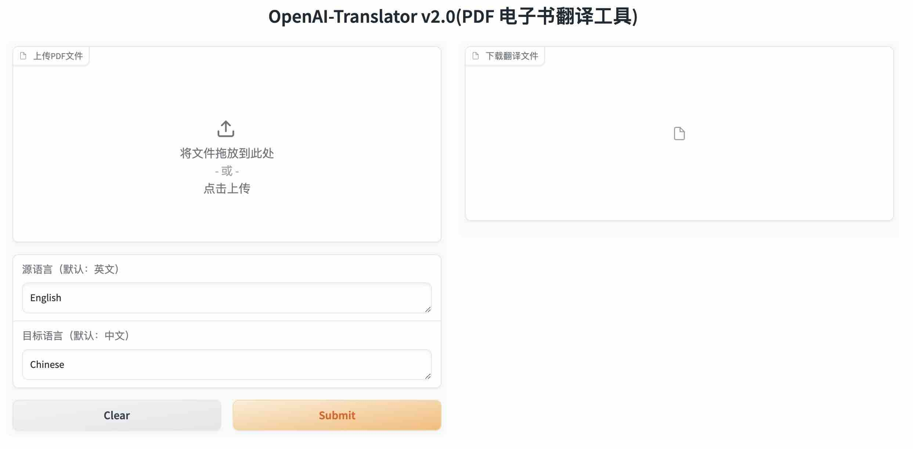

# OpenAI-Translator

## 介绍

基于 ChatGLM2-6B 实现带图形化界面的 [openai-translator](../../openai-translator/README-CN.md)

## 开始使用

### 环境准备

按照 [chatgml2-6b 使用说明](https://github.com/THUDM/ChatGLM2-6B?tab=readme-ov-file#chatglm2-6b-%E7%A4%BA%E4%BE%8B)下载并启动 api.py，得到 chatglm2-6b 服务地址为：[http://127.0.0.1:8000](http://0.0.0.0:8000)（也可以根据情况修改）

#### 配置文件

根据您的设置调整 `config.yaml` 文件：

```yaml
input_file: "tests/test.pdf"
output_file_format: "markdown"
source_language: "English"
target_language: "Chinese"
ai_api_base_url: "http://0.0.0.0:8000"
```

#### 调整代码

在[translation_chain.py](./translator/translation_chain.py)文件中将 ChatOpenAI 换成 ChatGLM

```python
        llm = ChatGLM(
            endpoint_url=base_url,
            max_token=80000,
            top_p=0.9,
            model_kwargs={"sample_model_args": False},
            verbose=verbose,
        )
```

#### 运行

```bash
python gradio_server.py
```

然后浏览器访问  <http://0.0.0.0:7860>


## 许可证

该项目采用 GPL-3.0 许可证。有关详细信息，请查看 [LICENSE](LICENSE) 文件。
