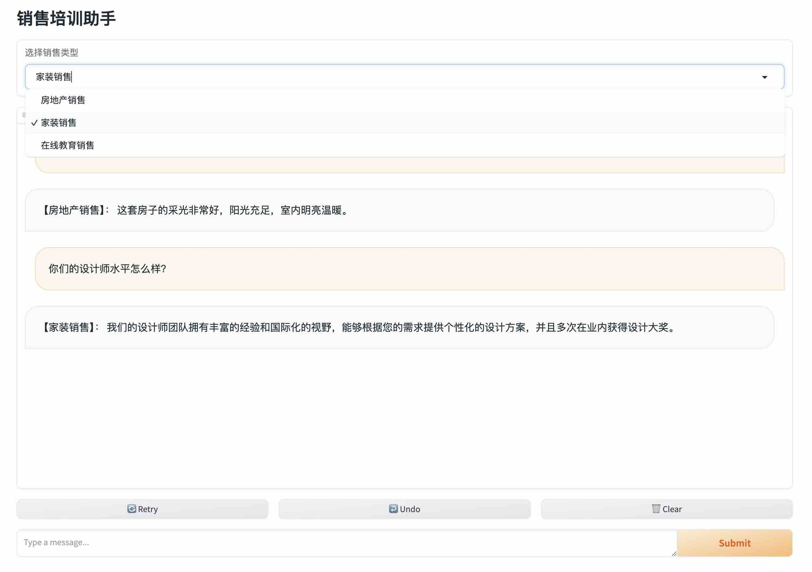
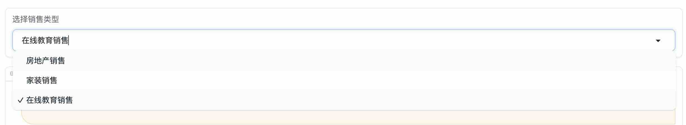
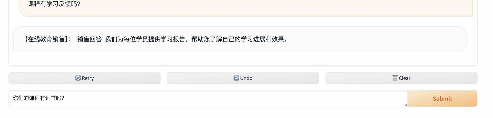

# 销售培训助手介绍

提供了房产销售、家装销售、在线教育课程销售培训聊天机器人



## 开始使用

### 运行

1. 根据世界清空配置环境变量
    * `OPENAI_API_KEY`：必需，设置 model 名称，例如：`gpt-3.5-turbo`
    * `OPENAI_MODEL`：可选，model 名称，默认：`gpt-3.5-turbo`
    * `OPENAI_BASE_URL`：可选，设置 OpenAI API 基础 URL，例如：`https://api.openai.com/v1/`

2. 进入 sales_chatbot 目录然后运行

```bash
cd sales_chatbot
python server.py
```

### 使用

1. 选择要培训的助手


2. 输入要聊天的内容然后点击 “Submit" 按钮


## 许可证

该项目采用 GPL-3.0 许可证。有关详细信息，请查看 [LICENSE](../LICENSE) 文件。
