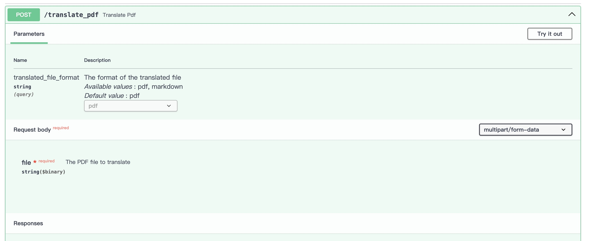

# OpenAI-Translator API 服务

## 介绍

以 API 形式提供翻译服务支持



## 开始使用

### 环境准备

1. 确保您按照 [中文](../README-CN.md) / [英文](../README.md)中的说明准备了环境（包括设置了API密钥）

2. 设置环境变量
    * `OPENAI_MODEL`：必需，设置 model 名称，例如：`gpt-3.5-turbo`
    * `OPENAI_BASE_URL`：可选，设置 OpenAI API 基础 URL，例如：`https://api.openai.com/v1/`
    * `OPENAI_DEFAULT_MODEL`：可选，不设置为：`gpt-3.5-turbo`

3. 安装依赖包 `pip install "uvicorn[standard]"`

### 运行

1. 进入 api 目录然后运行

```bash
cd api
python main.py --reload
```

> --reload：让服务器在更新代码后重新启动。仅在开发时使用该选项。

2. 进入交互式 API 文档

    打开浏览器访问 <http://127.0.0.1:8000/docs>

    

## 许可证

该项目采用 GPL-3.0 许可证。有关详细信息，请查看 [LICENSE](../LICENSE) 文件。
